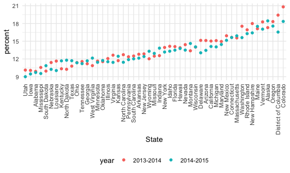

Reading data from the web
================

## Strings and regex

``` r
string_vec = c("my", "name", "is", "jeff")

str_detect(string_vec, "jeff")
```

    ## [1] FALSE FALSE FALSE  TRUE

``` r
str_replace(string_vec, "jeff", "Jeff")
```

    ## [1] "my"   "name" "is"   "Jeff"

``` r
string_vec = c(
  "i think we all rule for participating",
  "i think i have been caught",
  "i think this will be quite fun",
  "it will be fun, i think"
)

#test if something starts with "i think"
str_detect(string_vec, "^i think")
```

    ## [1]  TRUE  TRUE  TRUE FALSE

``` r
#test something ends with "i think"
str_detect(string_vec, "i think$")
```

    ## [1] FALSE FALSE FALSE  TRUE

``` r
string_vec = c(
  "Y'all remember Pres. HW Bush?",
  "I saw a green bush",
  "BBQ and Bushwalking at Molonglo Gorge",
  "BUSH -- LIVE IN CONCERT!"
)

str_detect(string_vec, "bush")
```

    ## [1] FALSE  TRUE FALSE FALSE

``` r
str_detect(string_vec, "Bush")
```

    ## [1]  TRUE FALSE  TRUE FALSE

``` r
str_detect(string_vec, "[Bb]ush")
```

    ## [1]  TRUE  TRUE  TRUE FALSE

``` r
string_vec = c(
  "7th inning stretch",
  "1st half soon to begin, Texas won the toss.",
  "she is 5 feet 4 inches tall",
  "3AM - cant sleep :("
)
#test if the string starts with a number then a letter
str_detect(string_vec, "^[0-9][a-zA-Z]")
```

    ## [1]  TRUE  TRUE FALSE  TRUE

``` r
string_vec = c(
  "It's 7:11 in the evening",
  "want to go to 7-11",
  "my flight is AA711",
  "NetBios: scanning ip 203.167.114.66"
)

#dot is a special character in regex
#to show dot as an actual dot, put a \
#to show \ as an actual slash, use \\
str_detect(string_vec, "7.11")
```

    ## [1]  TRUE  TRUE FALSE  TRUE

``` r
string_vec = c(
  "The CI is [2:5]",
  ":-]",
  ":-[",
  "I found the answer on pages [6-7]"
)

str_detect(string_vec, "\\[")
```

    ## [1]  TRUE FALSE  TRUE  TRUE

## Factors

``` r
factor_vec = factor(c("male", "male", "female", "female"))

factor_vec
```

    ## [1] male   male   female female
    ## Levels: female male

``` r
as.numeric(factor_vec)
```

    ## [1] 2 2 1 1

``` r
#female = 1, male = 2
```

what happens if I relevel ..

``` r
factor_vec = fct_relevel(factor_vec, "male")

factor_vec
```

    ## [1] male   male   female female
    ## Levels: male female

``` r
as.numeric(factor_vec)
```

    ## [1] 1 1 2 2

``` r
#male = 1, female = 2
```

## NSDUH – strings

``` r
url = "http://samhda.s3-us-gov-west-1.amazonaws.com/s3fs-public/field-uploads/2k15StateFiles/NSDUHsaeShortTermCHG2015.htm"

drug_use_html = read_html(url)

tb_marj = 
  drug_use_html %>% 
  html_nodes(css = "table") %>% 
  first() %>% 
  html_table() %>% 
  slice(-1) %>% 
  as_tibble()
```

``` r
data_marj = 
  tb_marj %>% 
  select(-contains("P Value")) %>% 
  pivot_longer(
    -State,
    names_to = "age_year",
    values_to = "percent"
  ) %>% 
  #because ( is a special character, we need two \\
  separate(age_year, into = c("age", "year"), sep = "\\(") %>% 
  mutate(
    #replace the ) with nothing
    year = str_replace(year, "\\)", ""),
    #remove letters that ends with: a,b,c 
    percent = str_replace(percent, "[a-c]$", ""),
    percent = as.numeric(percent)
  ) %>% 
  filter(!State %in% c("Total U.S.", "Northeast", "Midwest", "South", "West"))
```

## NSDUH – factors

``` r
data_marj %>% 
  filter(age == "12-17") %>% 
  #put state in order according to percent
  #so the plot would look nicer
  mutate(State = fct_reorder(State, percent)) %>% 
  ggplot(aes(x = State, y = percent, color = year)) +
  geom_point() +
  theme(axis.text.x = element_text(angle = 90, vjust = 0.5, hjust =1))
```


